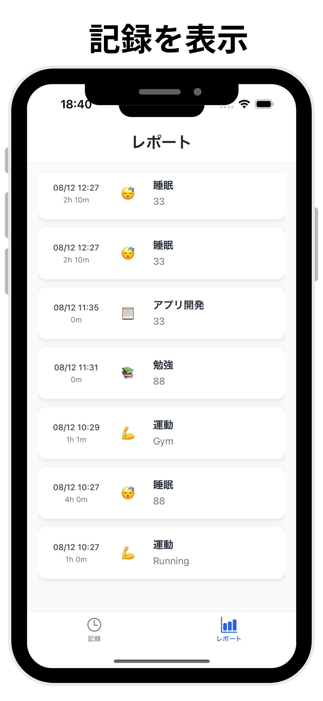
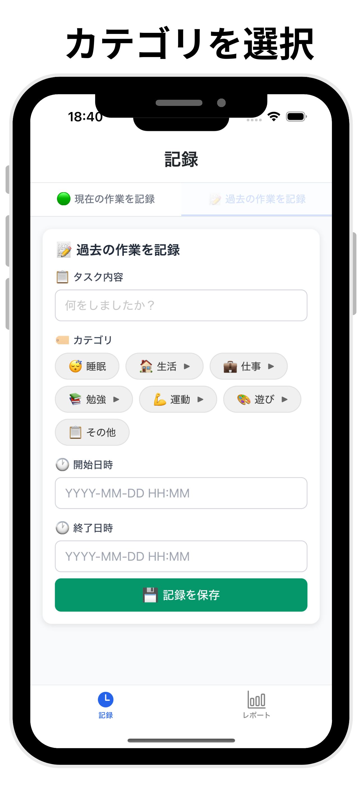
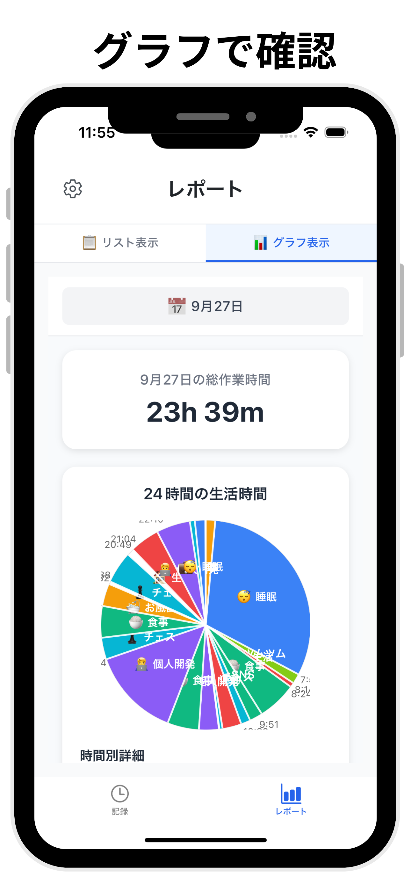

# time-control-app
[時間管理アプリ24](https://apps.apple.com/jp/app/%E6%99%82%E9%96%93%E7%AE%A1%E7%90%86%E3%82%A2%E3%83%97%E3%83%AA24/id6751039070)

## アプリのスクリーンショット(iPhone版)

## 準備
- `GoogleService-Info.plist`を用意する

## 開発
- `npm install expo`
- `npx expo start`
- シミュレーターを起動: `npx expo start --ios`

### パッケージをインストール
- `npx expo install package-name`
- `npx expo run:ios`: ビルドを行う.

### 環境変数
環境変数はgitignoreされている
- .env

#### Expoの環境変数に登録する
- `eas env:list`

### ビルド
- `npx expo run:ios` : 新しいシミュレーターでアプリがないときにはビルドが必要
- `npx expo prebuild --platform ios`

### バージョン
- メジャー: 互換性に影響する大きな変更
- マイナー: 互換性に影響しない新規機能追加
- パッチ: バグ修正

更新したら`npx expo prebuild --platform ios`を実行

## デプロイ

### Cloud Functions
#### functionデプロイ
##### 準備
- `npm install -g firebase-tools`
- `firebase login`

##### lint
- `cd cloud-functions/functions`
- `npm run lint:fix`

##### 実行
- `cd cloud-functions`
- `firebase deploy --only functions`

#### マイグレーション実行
Firestore Databaseにあるデータを変更するとき

1. cloud-functions/functions/scripts/migrate-*.tsファイルを作成する
1. `cd cloud-functions/functions`
2. `GOOGLE_APPLICATION_CREDENTIALS="secret/serviceAccountKey.json" npx ts-node scripts/migrate-*.ts`

### Expo
#### 準備
Expo管理画面でプロジェクトを選択->サイドバーのEnvironment variablesから.envをアップロードする
アプリからみられないようにする情報はSecretにする

- `npm install -g eas-cli`
- `eas login`

#### 実行
変更内容はコミット・プッシュする
不要な変更は削除する。コミットしてなくても反映されているかも
- `eas build --platform ios`
- `eas submit --platform ios`

jsの変更を更新
- `eas update --branch production --message "コメントを書く"`